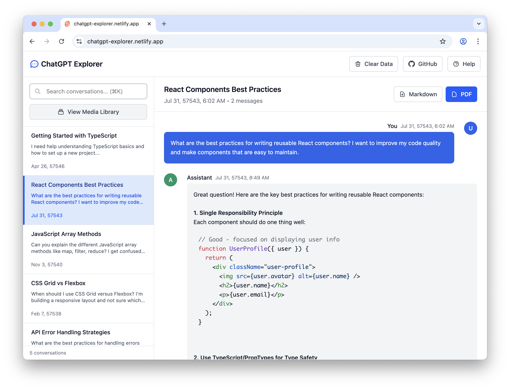

# ChatGPT Conversation Explorer

[](https://opensource.org/licenses/MIT)
[](https://svelte.dev/)
<!-- [](https://web.dev/progressive-web-apps/) -->

A fast, offline-first Progressive Web Application (PWA) that allows you to browse, search, and explore your ChatGPT conversation history locally in your browser. All processing happens client-side for maximum privacy and security.



## 🎯 Purpose

**Privacy-focused exploration of your ChatGPT conversations.** This tool solves the problem of ChatGPT's export format being difficult to navigate and search. Instead of manually parsing JSON files, you get:

- **Intuitive Interface** - Chat-like conversation view similar to ChatGPT
- **Powerful Search** - Real-time search across all your conversations
- **Complete Privacy** - All data processing happens locally in your browser
- **Media Support** - View images, play audio, and access attachments
- **Offline Access** - Works without an internet connection once loaded

## 🗂️ How to Get Your ChatGPT Data

Before using this tool, you need to export your ChatGPT conversation history from OpenAI:

### Step 1: Request Your Data Export

1. Visit [ChatGPT](https://chat.openai.com/) and sign in to your account
2. Click on your profile icon in the bottom-left corner
3. Go to **Settings** → **Data controls**
4. Click **"Export data"**
5. Confirm your request via email

### Step 2: Download Your Export

- OpenAI will email you when your export is ready (usually within 24 hours)
- Download the ZIP file from the link in the email

### What's Included in Your Export

Your ZIP file contains:

- `conversations.json` - All your conversation data
- `file-*` pattern images (screenshots, uploads)
- `dalle-generations/` - AI-generated images from DALL-E
- `audio/` folders - Voice conversation recordings
- `user-*/` directories - Files you uploaded to ChatGPT

## 🔄 How It Works

The ChatGPT Explorer processes your data through these steps:

### 1. **Secure Upload**

Drop your ChatGPT export ZIP file into the browser. No data leaves your device.

### 2. **Client-Side Processing**

- Unzips and parses your `conversations.json` file
- Reconstructs conversation threads from ChatGPT's mapping structure
- Extracts and links media files (images, audio, documents)
- Builds a searchable index of all message content

### 3. **Interactive Exploration**

- Browse conversations in a familiar chat interface
- Search across all conversations with real-time highlighting
- View images and play audio files inline
- Access conversation metadata and timestamps

### 4. **Offline Operation**

Once loaded, the app works completely offline thanks to PWA caching.

## ✨ Key Features

- 🔒 **Privacy First** - Zero data transmission, 100% local processing
- 🔍 **Powerful Search** - Real-time search with keyword highlighting
- 📱 **Responsive Design** - Works on desktop, tablet, and mobile
- 🖼️ **Media Support** - Display images, play audio, view attachments
- 🌐 **Offline Ready** - Progressive Web App with offline capabilities

## 🚀 Quick Start

### For Users

1. Visit the hosted application at [your-domain.com]
2. Drag and drop your ChatGPT export ZIP file
3. Wait for processing to complete
4. Start exploring your conversations!

### Development Setup

#### Prerequisites

- Node.js 22+
- npm, pnpm, or yarn

#### Installation

Clone the repository. Then

```bash
# Install dependencies
npm install

# Start development server
npm run dev
```

## 🔐 Privacy & Security

### Data Privacy Commitment

- **No Data Transmission** - Your conversations never leave your device
- **No Analytics** - No tracking, telemetry, or usage statistics
- **No Storage** - Data is only kept in memory during your session
- **Open Source** - Complete transparency in how your data is handled

## 📜 License

This project is licensed under the MIT License - see the [LICENSE](LICENSE) file for details.

## ⚠️ Disclaimer

This project was developed with assistance from AI tools including Claude and other language models. While thoroughly tested, please review the code and use at your own discretion. The application processes sensitive conversation data, so we recommend reviewing the source code to ensure it meets your security requirements.
